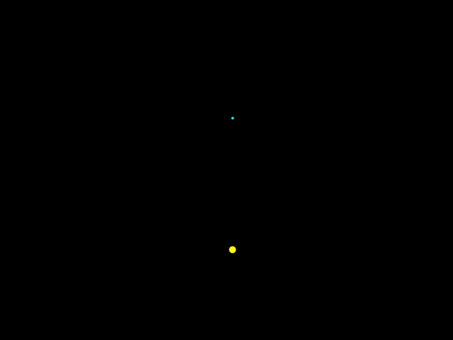
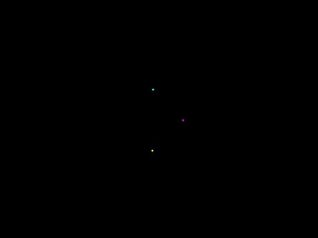

# n-body-Simulation
My take at simulating the n-body problem using a simple numerical integration approach.

There are a few things to note:
 - the simulation is based entirely on Newtonian mechanics;
 - the reference frame from which the motion is being viewed is the center of mass reference frame;
 - the motion is planar, so that the motion takes place entirely in two dimensions;
 - gravity is turned off when the objects come too close together;
 - objects will never strike each other.
 
The simulation will of course become more inaccurate further into the animations (significantly, in fact, as the motion is chaotic for more than two bodies); however, it is nevertheless interesting to see how the bodies can generally be expected to behave in various situations. Greater accuracy can be obtained with greater computation power and time (or more efficient programs).
 
 
